# FinanceOS — Interview Reference Document

This document covers the technical decisions, architecture, and honest capabilities of the project for interview discussions.

---

## Project Summary

FinanceOS is a full-stack personal finance tracking application built with Next.js 14. It handles transaction management, budgeting, CSV bank statement import, and AI-powered financial analysis using a multi-agent routing system. The entire application runs in a single Next.js repo — no separate backend service.

**What makes it worth discussing in an interview:**
- Multi-agent AI architecture with intent routing across two providers
- Human-in-the-loop pattern for AI-triggered database writes
- Proper handling of edge cases (timezone bugs in CSV import, BOM characters, SQLite foreign key constraints)
- All AI math computed in TypeScript — LLM only writes descriptions

---

## Architecture Decisions

### Why SQLite instead of PostgreSQL

The data is personal and local. SQLite has zero setup — `npm run db:push` creates the file. `better-sqlite3` is synchronous which simplifies the Drizzle queries. For a personal finance app with one user and under 10,000 transactions, SQLite is faster than a network round-trip to Postgres. If this were multi-tenant, I'd switch to Turso (distributed SQLite) or PostgreSQL.

### Why everything in one Next.js repo

The AI agents need to query SQLite directly. If the agent logic were in a separate Python service, every query would require an HTTP call from Python to Next.js to SQLite and back — adding latency and auth complexity for no benefit. The data is already there; the agents live next to it.

### Why Drizzle ORM over Prisma

Drizzle generates SQL you can read and understand. It has no separate migration server process, no shadow database requirement, and the TypeScript types are inferred directly from the schema definition. `db:push` is one command. For this project size, Drizzle is simpler.

### Why NextAuth v5 with JWT instead of sessions

JWT means no database lookup on every request — the middleware just verifies the token. The edge-safe `auth.config.ts` handles route protection without importing the DB client, which avoids the edge runtime error with `better-sqlite3`.

### Why split auth into two files

`better-sqlite3` cannot run in the Next.js Edge Runtime (which middleware uses). `auth.config.ts` contains only the JWT callbacks — no DB import. `auth.ts` adds the Credentials provider which needs the DB. Middleware imports only `auth.config.ts`. This is the official NextAuth v5 pattern for Node.js adapters.

---

## AI Architecture

### The routing problem

Most finance apps that use AI send every question to the same model. This works but wastes compute — a simple "what is my balance?" question goes through a 70B parameter model when a small model would answer it correctly in a fraction of the time.

### How the router works

Every user message first goes to Groq Llama 3.1 8B — a small, fast model hosted on Groq's LPU hardware. It classifies the message into one of four intents: `data_query`, `strategy`, `action`, or `simple`. This takes roughly 200-400ms.

The intent determines which model handles the actual response:
- `data_query` and `action` → Accountant (OpenRouter Hunter Alpha) — has tool calling to query SQLite
- `strategy` → Strategist (OpenRouter Healer Alpha) — handles what-if scenarios and projections

### Why code does all the math

Early versions sent raw transaction lists to the LLM and asked it to calculate monthly totals. The LLM consistently made arithmetic errors — adding numbers incorrectly, missing transactions, confusing months. The fix was to compute everything in TypeScript first and pass only pre-calculated results to the LLM. The system prompt now says "these numbers are pre-calculated, quote them directly, do not recalculate." This eliminated incorrect answers entirely.

This is the most important design decision in the AI layer.

### Tool calling

The Accountant agent has six tools it can call:
- `query_transactions` — fetch transactions filtered by date, type, or description keyword
- `get_spending_summary` — monthly income/expense totals grouped by YYYY-MM
- `create_budget` — write a new budget to SQLite (requires HITL approval)
- `categorize_transaction` — bulk-update category on transactions matching a description
- `save_memory` — persist key-value facts to `ai_memory` table
- `get_accounts` — current account balances

The Vercel AI SDK handles the tool call loop — the model calls a tool, gets the result, decides if it needs another tool, and continues up to 5 steps before generating a response.

### Human-in-the-Loop (HITL)

For actions that write to the database, the agent calls `propose_action` instead of writing directly. This returns a structured proposal object to the frontend. The UI renders an approval card with Approve and Deny buttons. The database is only written after the user clicks Approve.

This matters for two reasons: it prevents the AI from making unintended changes, and it shows the user exactly what will happen before it happens.

### Anomaly detection

The anomaly radar does three passes in TypeScript before calling any AI:
1. Duplicate detection — same description + amount appearing more than once in the latest month
2. Spike detection — current month amount divided by 4-month historical average >= 2.0
3. Large one-off detection — amount >= $300 with no historical data for that description

If none of these trigger, the function returns an empty array without calling the AI at all. The LLM only runs when there are pre-detected issues to describe. This means zero false positives from hallucination.

### Memory persistence

Chat history is saved to a `chat_history` SQLite table after every exchange. When the component mounts, it fetches the last 40 messages from the DB and restores them to React state. `ai_memory` stores key-value facts the AI learns about the user (savings goals, preferences) that persist indefinitely.

---

## Database Schema

```
users           id, name, email, password, created_at
accounts        id, userId, name, type, balance, color
categories      id, userId, name, icon, color, type
transactions    id, userId, accountId, categoryId, amount, type, description, date
budgets         id, userId, categoryId, name, amount, period, startDate
ai_memory       id, userId, key, value, updated_at
chat_history    id, userId, role, content, created_at
agent_logs      id, userId, sessionId, agent, model, action, durationMs, created_at
sentinel_alerts id, userId, budgetName, severity, percentUsed, message, read, created_at
```

All tables cascade-delete on user removal. Foreign keys enforced by SQLite WAL mode.

---

## Problems Solved During Development

### Timezone bug in CSV import

Bank CSV files from Excel had dates shifting back by one day. For example `2025-12-01` was stored as `2025-11-30`.

Root cause: Excel adds a BOM character (`\uFEFF`) at the start of CSV files. This prepended to the first date value making it `2025-12-01`. The regex `/^\d{4}-\d{2}-\d{2}$/` didn't match, so the code fell through to `new Date("2025-12-01")` which parses as UTC midnight. In IST (UTC+5:30) that's `2025-11-30T18:30` local time.

Fix: Strip BOM at parse time with `text.replace(/^\uFEFF/, "")`. If the date string already matches `yyyy-MM-dd`, skip parsing entirely. For other formats, use `new Date(year, month-1, day)` (local constructor) instead of `new Date(string)` (UTC constructor).

### Edge runtime incompatibility

The first version crashed with `URL_SCHEME_NOT_SUPPORTED: file:` because `better-sqlite3` was being imported inside the Next.js middleware which runs in the Edge Runtime.

Fix: Split `auth.ts` into two files. `auth.config.ts` has no database imports and is safe for the edge. `middleware.ts` uses `getToken()` from `next-auth/jwt` for pure JWT verification with no DB access. `auth.ts` (full config with Credentials provider) is only imported in Node.js API routes.

### LLM arithmetic errors

Early versions asked Groq to calculate "what was my total income in December?" by passing the raw transaction list. It consistently returned wrong numbers — summing incorrectly, missing transactions, or confusing calendar months.

Fix: TypeScript pre-computes a monthly summary table with exact totals for every month. The system prompt passes this table and explicitly instructs the model to quote numbers from it rather than calculate.

### Non-ASCII characters in HTTP headers

The agent trace contained `→` (Unicode 8594). HTTP headers only accept bytes 0–255. `headers.set()` threw a `ByteString conversion` error.

Fix: Encode the trace JSON as base64 before setting the header. Decode with `atob()` on the frontend.

### SQLite foreign key constraint on CSV import

CSV import failed with `SQLITE_CONSTRAINT_FOREIGNKEY` when the `accountId` in the request didn't exist in the database.

Root cause: The frontend was sending an account ID that didn't belong to the current user, or the user had no accounts yet.

Fix: Before inserting, validate all `accountId` values against the user's actual accounts. Return a clear error message if any are invalid.

---

## What I would improve with more time

**Recurring transactions** — the schema supports marking transactions as recurring but there's no scheduler to auto-create them. Would need a cron job or check on page load.

**Budget adherence in health score** — currently just counts how many budgets exist. A more useful score would compare actual monthly spend against each budget limit and calculate a real adherence percentage.

**Mobile layout** — the sidebar doesn't collapse on small screens. The transaction table is readable on mobile but not optimized for touch.

**OpenRouter model stability** — free tier models on OpenRouter appear and disappear. The current setup has Groq as fallback but a more robust system would detect model availability at startup and choose from a ranked list.

**Deployment** — the app runs locally. To deploy publicly, SQLite needs to be replaced with Turso (distributed SQLite with a compatible API) and the app deployed to Vercel. This is straightforward but not done.

---

## How to Explain the Multi-Agent System in an Interview

**Simple version:**
"Instead of sending every question to one AI model, I built a routing layer. A small fast model classifies what the user is asking, then routes to a specialist model. Data questions go to one model that has database tools. Planning questions go to another model that's better at math and projections."

**If they ask why not just use one model:**
"One model works fine but it's wasteful. Classifying intent takes 20 tokens. Running a 70B model to do that is like taking a taxi to check your mailbox. The 8B router is faster and just as accurate for classification. The specialist models are only called when needed."

**If they ask about accuracy:**
"All calculations run in TypeScript before the AI is called. The AI never does arithmetic — it reads a pre-computed table and writes a description of what it says. This is why the answer to 'what was my income in December' is always exactly correct rather than approximately correct."

**If they ask about HITL:**
"When the AI wants to create a budget or modify data, it returns a proposal object instead of writing directly. The frontend renders an approval card. The database only updates after the user clicks Approve. This is called Human-in-the-Loop — it's a standard safety pattern for AI systems that have write access."

---
## FinanceOS System Flow


